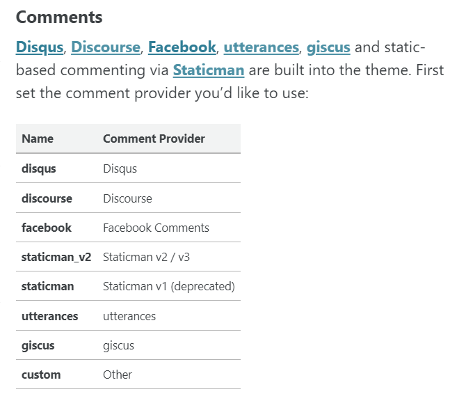
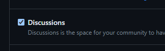
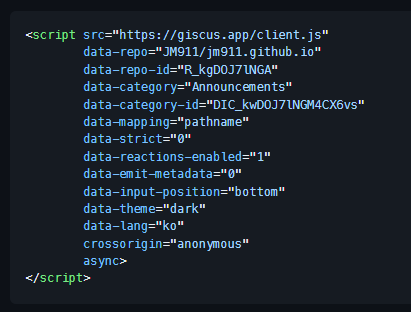
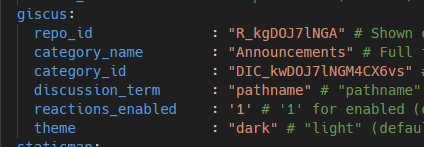
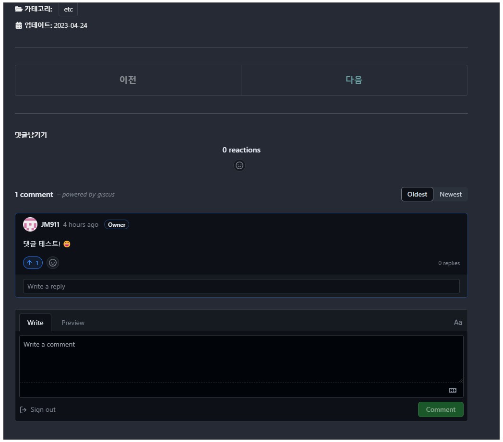
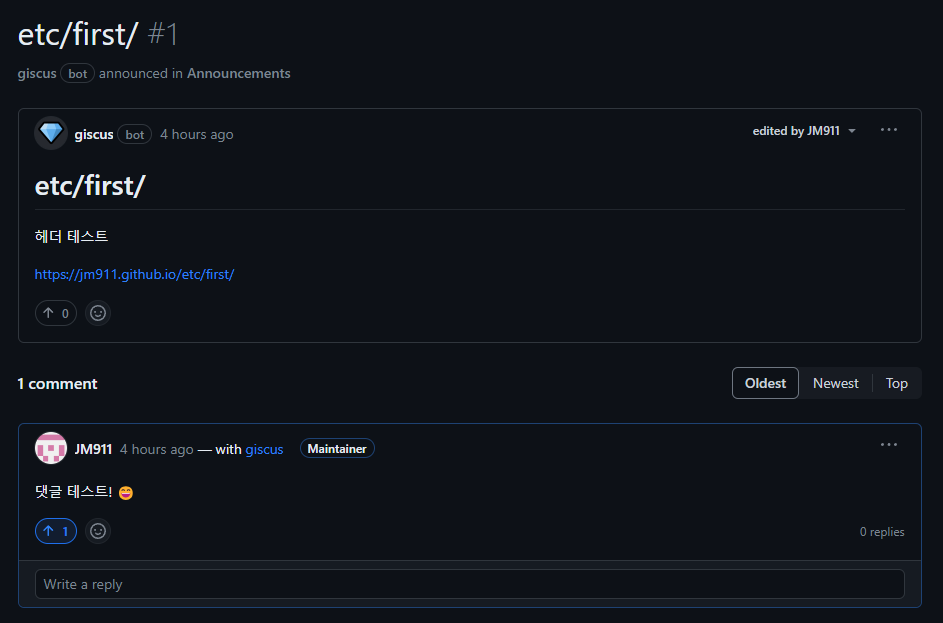

요 며칠간 블로그를 혼자 처음부터 다시 만들겠다고 가이드 문서를 따라 헤딩하다가 결국 따라하기 영상으로 돌아왔다.  
참고로 이 때 참고한 것이 테디노트님의 영상이다. (재생목록: [https://youtube.com/playlist?list=PLIMb_GuNnFwfQBZQwD-vCZENL5YLDZekr](https://youtube.com/playlist?list=PLIMb_GuNnFwfQBZQwD-vCZENL5YLDZekr))  
minimal mistakes 테마의 한국어 가이드는 웹 페이지로 꽤 많지만, 영상이 확실히 생각 없이 따라하기 좋고, 그렇다면 이거만한 게 없다.  
  
여튼 영상 내용 중 댓글을 추가하는 파트에서 disqus를 사용하시는 부분이 개인 취향에 맞지 않아 나는 다른 툴인 "giscus"를 택했다.  
굉장히 간단하지만 최종 세팅까지의 의식의 흐름을 정리해놓으려 한다.  
(가이드 목적은 아니기 때문에 잡설이 많을 수 있습니다)  
  
  
# 1. 댓글 작성 방식 고르기

다른 블로그 기능들과 마찬가지로 나같은 웹 프로그래밍에 무지한 사람들이 마음대로 댓글 기능을 추가하는 건 당연히 불가능하니 외부 툴을 이용해야 한다.  
튜토리얼 영상에서 사용한 disqus는 쓰지 않을 것 같은 기능들이 많고 무거워 보였으며, 유료가 아니면 지울 수 없는 광고가 있어 내 블로그에 투머치한 느낌이었다.  
그래서 사용할 수 있는 다른 툴의 종류를 찾아보기 위해 우선 minimal mistakes 테마의 가이드 문서를 보았다.  
  

[https://mmistakes.github.io/minimal-mistakes/docs/configuration/#comments](https://mmistakes.github.io/minimal-mistakes/docs/configuration/#comments)  
  
위 목록의 항목들을 하나씩 찾다 보니 여러 이유로 utterances와 giscus가 가장 마음에 들었다.  
우선 앞에서 disqus가 싫었던 이유들이 전혀 없었고(오픈 소스, 가벼움) 무엇보다 댓글 데이터가 외부 서버가 아닌 내 리파지토리 내에 쌓인다는 것이 컴팩트한 느낌이 들었다.
사실상 giscus가 utterances의 유사 변형 버전이기 때문에 거의 비슷하다.   
**다른 점은 utterances가 댓글 데이터를 git issue에 저장하고 사용하는 반면, giscus는 Discussion에서 작업한다는 점이다.**  
솔직히 둘의 차이점은 잘 모르지만 네이밍으로만 봐도 issue 보다는 discussion 이 이런 용도의 사용에 좀 더 부담이 없을 것 같다는 느낌이 들었다. (아마 giscus 자체가 다른 사람들도 비슷하게 생각했기 때문에 만들어진 게 아닐까 한다)  
  
그래서 댓글 제공자는 giscus로 결정.  
  
  
# 2. 댓글 추가
  
원래 진짜 웹 프로그래밍이라면 html 등 넣어야겠지만, minimal mistakes 테마에서 제공하는 댓글 툴 중 하나기 때문에 몇 가지 간단한 작업만 하면 등록이 된다.  
  
1. [https://github.com/apps/giscus](https://github.com/apps/giscus) 에서 giscus 를 자신의 깃헙에 설치해준다.
    - 나는 딱히 다른 곳에도 쓸 것 같지는 않아서 블로그 리파지토리에만 추가했다.
2. 블로그 리파지토리에서 Setting 에 들어가 Discussion 을 활성화 해준다.

3. [https://giscus.app/ko](https://giscus.app/ko) 에 접속하여 세팅을 모두 입력한다.
    - 저장소는 내 리파지토리 입력, 카테고리는 Announcements, 테마는 Dark 로 변경하고 나머지는 기본값을 사용했다.
    - 맨 밑에 html 코드가 뜨는데, minimal mistakes 테마이기 때문에 이것을 그대로 쓰지 않는다.
    
4. _config.yml 파일에서 comment 와 관련된 부분을 바꿔준다.
    - provider를 giscus로 기입하고, 그 외 giscus 파트에 앞서 얻은 html 소스에서 repo-id, category-id 등을 가져온다.
    
5. ★★ _config.yml 에 repository 항목이 반드시 입력되어 있어야 한다!
    - 이건 minimal mistakes 가이드에만 적혀있어 처음에 좀 헤맸다. 역시 모를 때는 문서를 다 뒤져봐야 한다. :cry:
6. 모두 커밋, 푸쉬하면 완성!
  

# 3. 결과 및 주의점
## 결과
{: .align-center}  
  
## 주의점
- 댓글은 모두 discussion 탭에 쌓이고, 여기를 누가 건드리면 경로 같은 게 바뀔 수 있다. 따라서 giscus도 외부인이 수정할 수 없는 Announcements 카테고리를 사용하도록 추천한다.
  
- 반대의 경우로, 내가 포스팅 카테고리를 정리하면서 경로가 바뀌면서 댓글이 사라질 수도 있다. :scream:
    - 나는 discussion 에서 맨 윗 항목(명칭을 모르겠다... 주제? 제목?)을 수정하여 해결했다. 아마 내용물은 관계가 없을 것 같지만 혹시 몰라 다 바꿔줬다.
    - 아마 우아한 방법이 있을 것 같지만 일단 나에게는 문제가 안되므로 그건 다음에 알아보기로 했다. :sunglasses:

